This page goes over the basics of Environment Management through the Anaconda Python distribution.

# Table of Contents

+ [Why Anaconda Environments?](#why-anaconda-environments?)
+ [Installing Anaconda](#installing-anaconda)
+ [Getting Started with Environments](#getting-started-with-environments)
    + [Using an Existing Environment](#using-an-existing-environment)
    + [Creating an Environment from Scratch](#creating-an-environment-from-scratch)
+ [Using Environments](#using-environments)
    + [General Workflow](#general-workflow)
    + [Executing Python (.py) Files](#executing-python-(.py)-files)
        + [Via Command Line](#via-command-line)
        + [Via Spyder IDE](#via-spyder-ide)
    + [Executing Applications](#executing-applications)
        + [Via Anaconda Navigator](#via-anaconda-navigator)
    + [Using Jupyter Notebooks](#using-jupyter-notebooks)
+ [Exporting an Environment](#exporting-an-environment)
+ [Step-by-Step Example](#step-by-step-example)

# Why Anaconda Environments?

That's a great question! An important part of science, especially computational science, is reproducibility. Being able to do an experiment on your own is great but it's important to be able to regenerate figures, expand upon existing experiments in the future, and make the tools available to the broader research community. A major barrier to reproducibility in the world of computational science is package dependencies. Packages used within computer code can change over time and old code can break or the behavior can be modified in negative ways thanks to those changes. When sharing code, we want to be able to setup a computer ecosystem that is exactly the same as when we were developing the code. To do this, we use 'environments.'
Anaconda is the most popular Python distribution for data science and is a great tool for environment management.
Note: Environments are meant to serve as a way to ensure that Python package installations on separate systems are the same. Environments are not like GitHub repositories in the sense that they take a “snapshot” of the folder you are working in. If you accidentally delete a file that is not version controlled through software like Git, you can’t recover it with environments!

# Installing Anaconda

Installing Anaconda is really simple. Go to the link, https://www.anaconda.com/distribution/#windows, and download the "Python 3.7 version." Accept all default settings.
Additionally, I find the Spyder IDE (Integrated Development Environment) to be helpful, although I do most of my code prototyping in the Jupyter Notebooks already installed with Anaconda. This can be installed by opening the Anaconda Navigation program and clicking the install button under the Sypder icon.

# Getting Started with Environments

This section covers what you need to know to get up and running with Anaconda environments. 
An important note: Anaconda begins in the “base” environment. This environment is the one that is packaged with the Anaconda installation. However, you’ll want to create an environment for your specific project/repository.

## Using an Existing Environment

If you are not starting an environment from scratch and are instead wishing to use an existing environment, follow these instructions.
1.	Find the `environment.yml` file located in the repository that you are wishing to work with.
2.	Launch the Anaconda Prompt and type, `conda env create -f environment.yml` in the prompt. Anaconda will handle the download and installation of all dependencies.
3.	Start working with your up-to-date repository!

## Creating an Environment from Scratch

If you would like to create an environment from scratch, follow the instructions found at, https://conda.io/projects/conda/en/latest/user-guide/tasks/manage-environments.html.
The general workflow is as follows:
1.	Create environment by typing, `conda create --name myenv` where `myenv` is the name of the environment you would like to create, in the Anaconda Prompt.
2.	Activate the environment with `conda activate myenv` in the Anaconda Prompt.
3.	Develop code and install the requisite packages for the code as you go, using either the `conda install --name myenv <package>` or `pip install <package>` functionality, where `<package>` is the name of the python package you wish to install.

# Using Environments

This section covers how to actually use environments. 

## General Workflow

The general workflow for using an environment is to:
1.	Create the environment, either from scratch or based off an existing environment. 
2.	Activate the environment, either using the command line approach described in Via Command Line or using the Anaconda Navigator graphical user interface described in Via Anaconda Navigator. Anaconda begins in the base environment, but you’ll want to activate an environment for your specific project/repository.
3.	Do whatever you would like to do with Python.
4.	Either close the programs you were working on and the Anaconda programs or deactivate the environment with `conda deactivate`.

## Executing Python (.py) Files

Python files can be executed in several ways with Anaconda.

### Via Command Line

1.	Open the Anaconda Prompt.
2.	Create an environment or use an existing one, explained in Getting Started with Environments.
3.	Activate the environment using `conda activate myenv` where `myenv` is the name of your environment. If you choose not to do this step, you will be executing in the `base` environment that comes with Anaconda, not the specific environment for your project/repository.
4.	Run the python file as normal. This could look like `python myfile.py`, `python3 myfile.py`, etc. The procedure for running files should be well documented in the README of the repository you are working with.

### Via Spyder IDE

Python files can also be run via the Spyder IDE. To do so:
1.	Follow the instructions found in Via Anaconda Navigator to open Spyder.
2.	Open the desired python file using Spyder.
3.	Click the green triangle “play” button to run the script.

## Executing Applications

Anaconda has all sorts of applications that aid in developing Python. For example, Jupyter notebooks are incredibly helpful for prototyping and rapid development of Python code and Spyder is a great integrated development environment. To launch these applications, follow the instructions below.

### Via Anaconda Navigator

1.	Open the Anaconda Navigator.
2.	Switch to the desired environment by clicking the drop-down menu next to the “Applications on” text. If you choose not to do this step, you will be executing in the `base` environment that comes with Anaconda, not the specific environment for your project/repository.
3.	Select the desired application from the list of applications. 

## Using Jupyter Notebooks
Jupyter notebooks are really helpful for prototyping code. To run one, do the following:
1.	Follow the instructions under Via Anaconda Navigator to open the Jupyter Notebook application. This should open a browser displaying the files on your system.
2.	Navigate to the repository you are wanting to work with by clicking through the file structure.
3.	Click on the notebook (.ipynb) you are wanting to run to open a new browser tab of your notebook.

# Exporting an Environment

Congratulations! You’ve had a paper accepted and it’s time to publish the repository to the greater scientific community. Follow these steps to create an environment YAML file that will be added to the repository.
1.	Ensure that the repository on your local machine matches the repository in GitHub.
2.	With the proper environment activated (using `conda activate myenv` where `myenv` is the name of the environment), type the following in the Anaconda Prompt: `conda env export  > environment.yml`.
3.	Place the `environment.yml` file in the proper place in the repository. This means placing it in a location where it will be easily discoverable by the end-user. Don’t stick it in a folder that has a million files where it will likely get lost.
4.	Update the documentation for the repository to note where to find the `environment.yml` file and how to create an Anaconda environment from this file. You can just use a slightly modified version of the instructions found in the Using an Existing Environment section.
5.	Add the `environment.yml` file to the repository, commit, and push changes to GitHub.

# Step-by-Step Example
This section shows a step-by-step example of how to download Anaconda, set up an environment, begin working with the environment, and run MyoSim.

1.	Download GitHub Desktop and follow installation instructions by visiting https://desktop.github.com/ and clicking the “Download for Windows” button.

 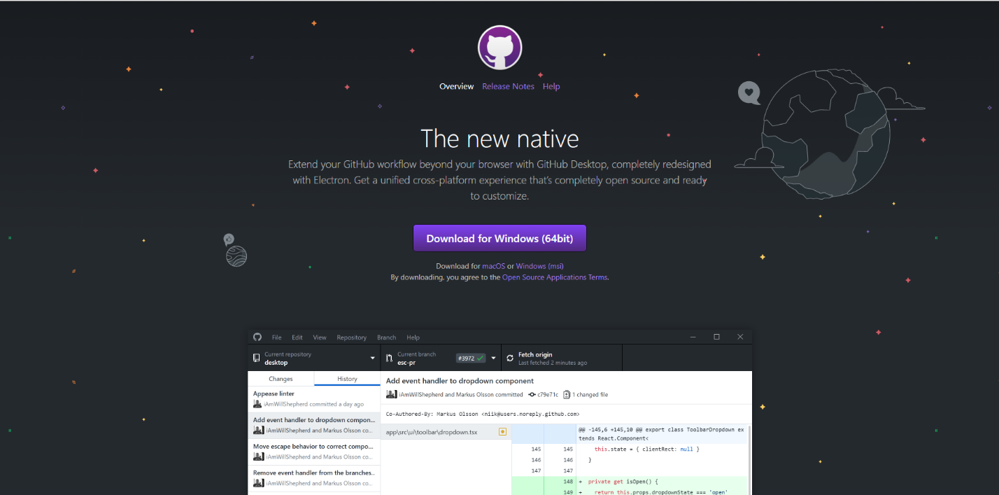

2.	Launch GitHub Desktop through the Start Menu.

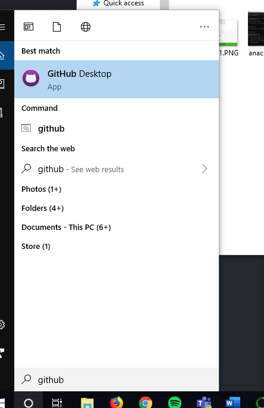

3.	Sign into your GitHub account when prompted.
4.	Click “File” then click “Clone Repository”.

 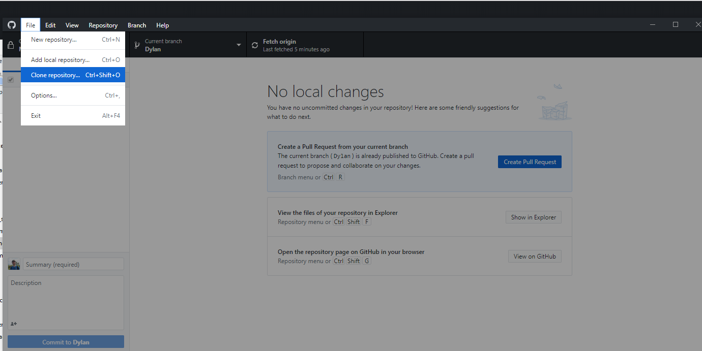

5.	Clone the Python_MyoSim repository.

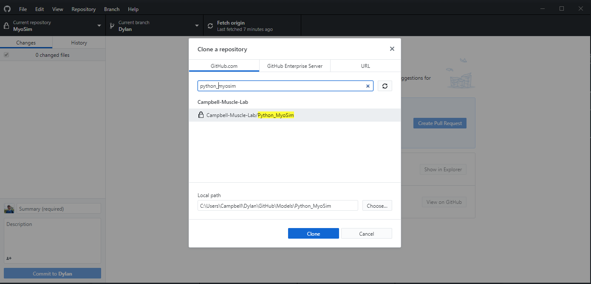 

6.	Download Anaconda - Go to https://www.anaconda.com/distribution/ and download the Python 3.7 version of Anaconda after clicking the “Windows” button.

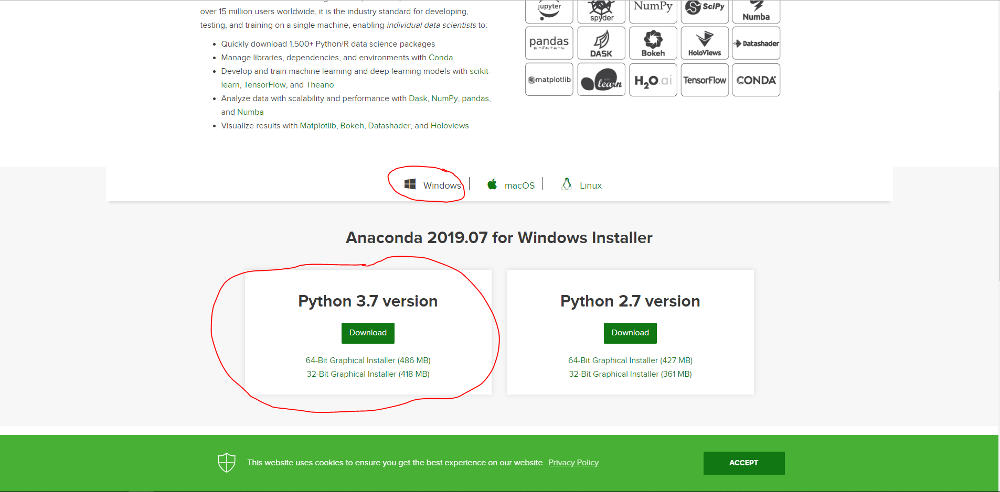 

7.	Follow the installation instructions prompted by the Anaconda installer and accept all default options.
8.	Launch the Anaconda Prompt from the Start Menu.

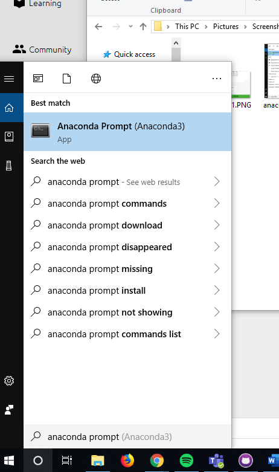

9.	Type `conda create –name <NAME_OF_YOUR_ENVIRONMENT>` where `<NAME_OF_YOUR_ENVIRONMENT>` is the name of the environment you would like to create. In this example, I’ve chosen `example_environment`. Type `y` for “yes” when you’re prompted to and hit <kbd>Enter</kbd> on your keyboard.

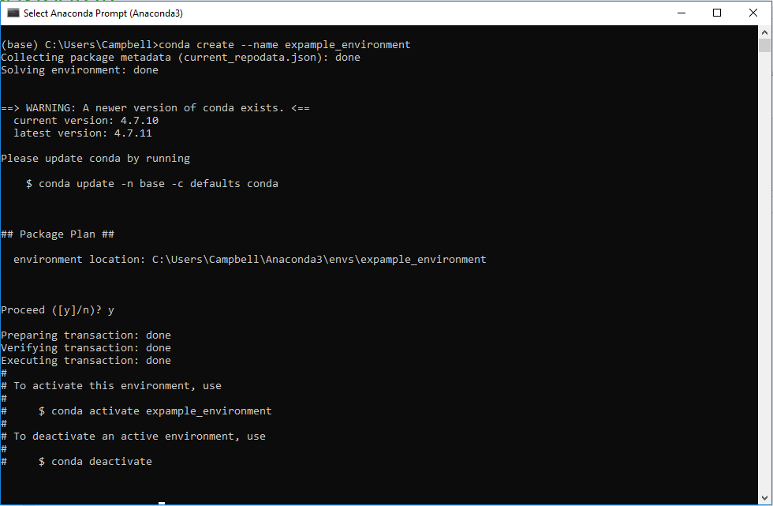

10.	Launch the Anaconda Navigator from the Start Menu.

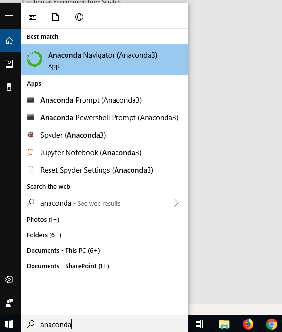

11.	 Change into the created environment by selecting it from the drop-down menu in the Anaconda Navigator.

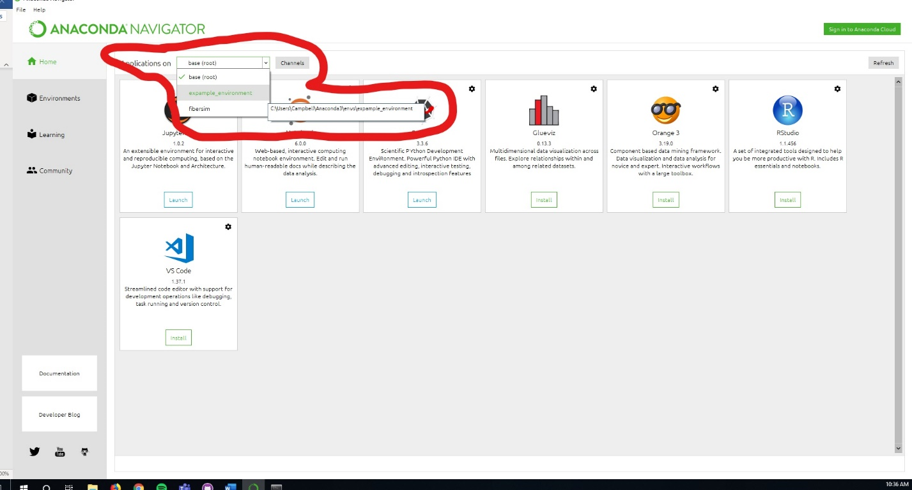

12.	Click the “Environments” button on the left panel of the Anaconda Navigator.

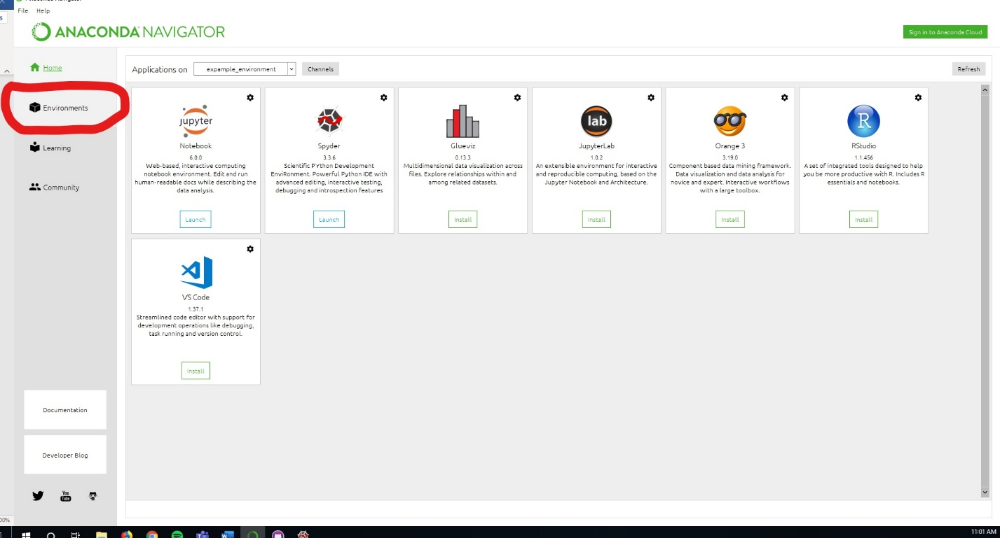

13.	Change the package view to “Not Installed” by selecting it from the drop-down menu.

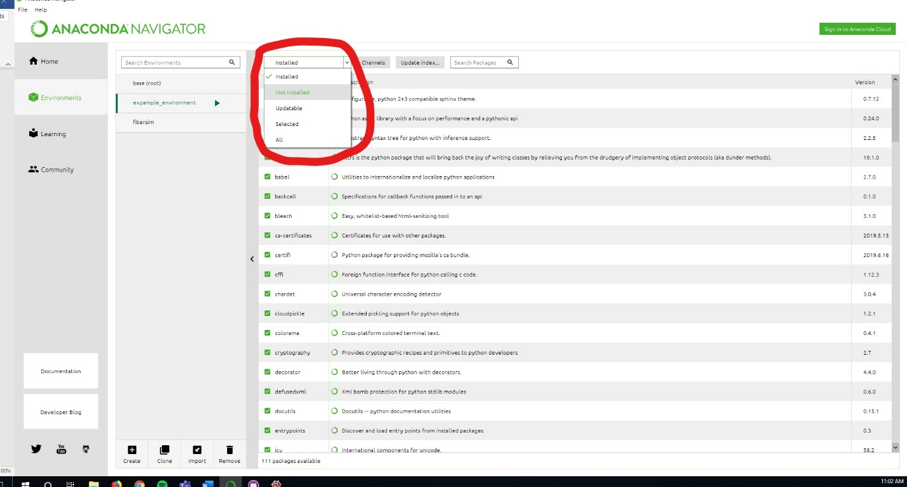

14.	Search for and click the check box of numpy package.

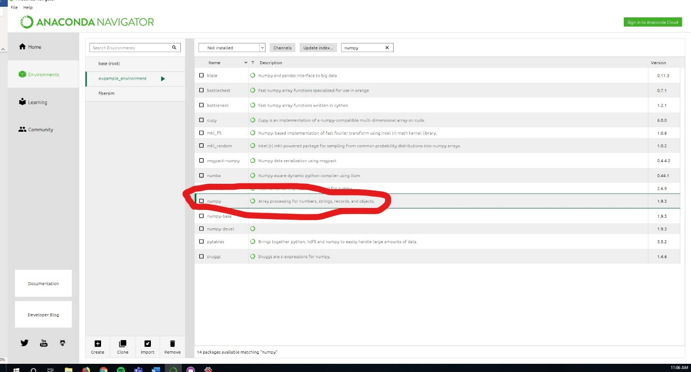

15.	Repeat step 14 for the following packages: “pandas”, “matplotlib”, “scipy”. 
16.	Click “Apply” on the bottom left of the screen and proceed through the prompts.
17.	Navigate back to “Home”.

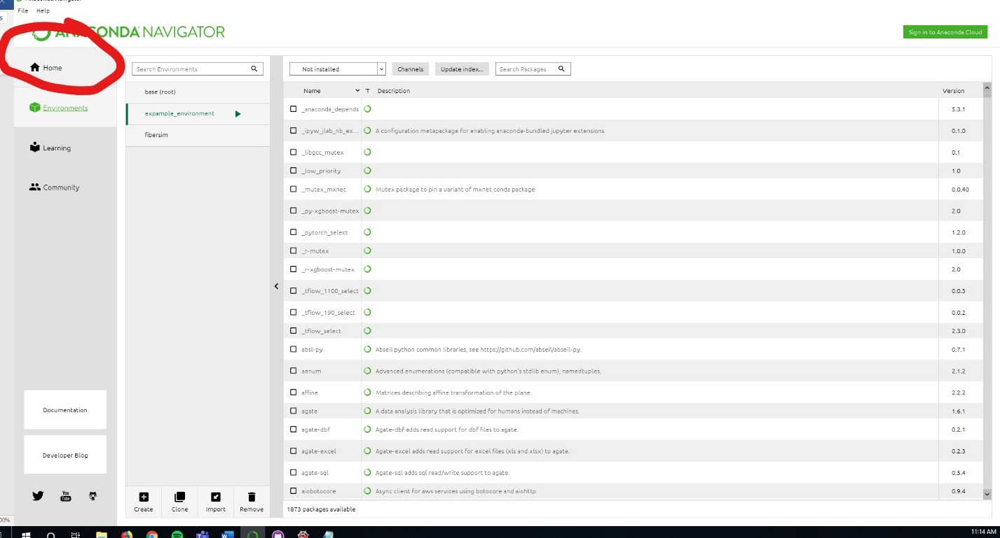

18.	Install Spyder and Jupyter Notebook by clicking “Install” for both applications.

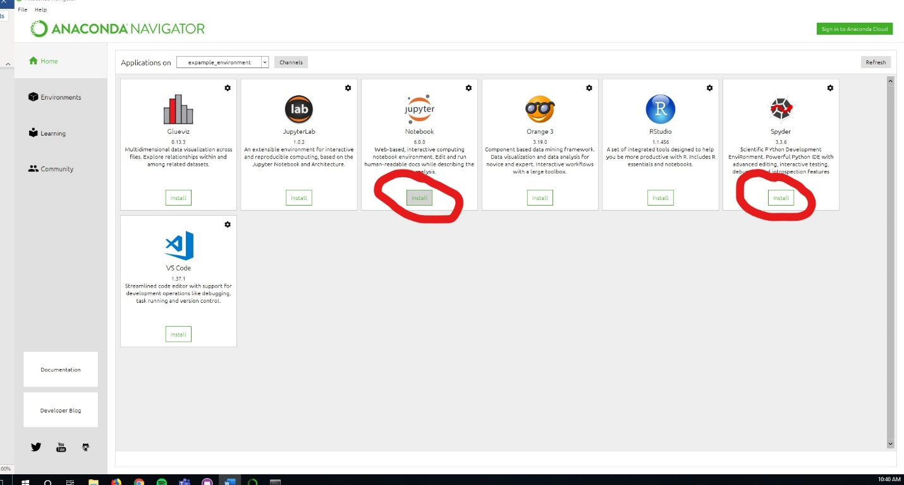

19.	Launch Spyder through the same Anaconda Navigator window after installation.

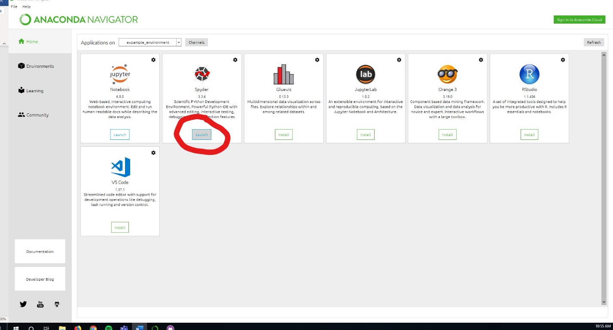

20.	Begin coding.
