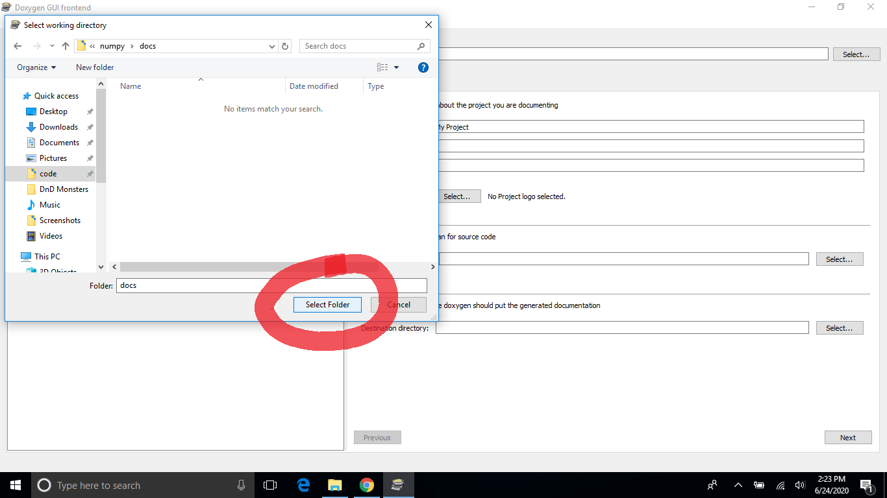
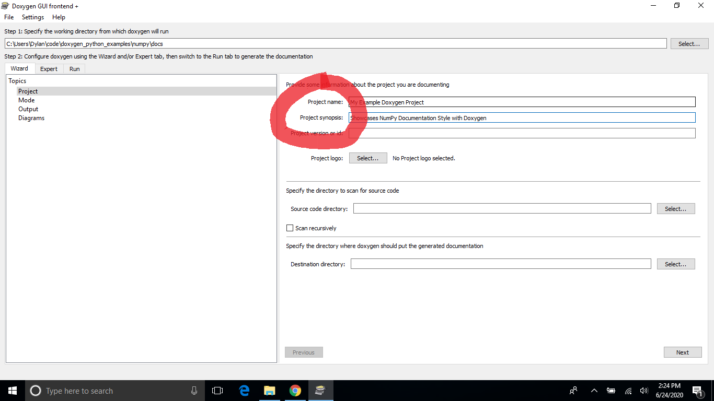
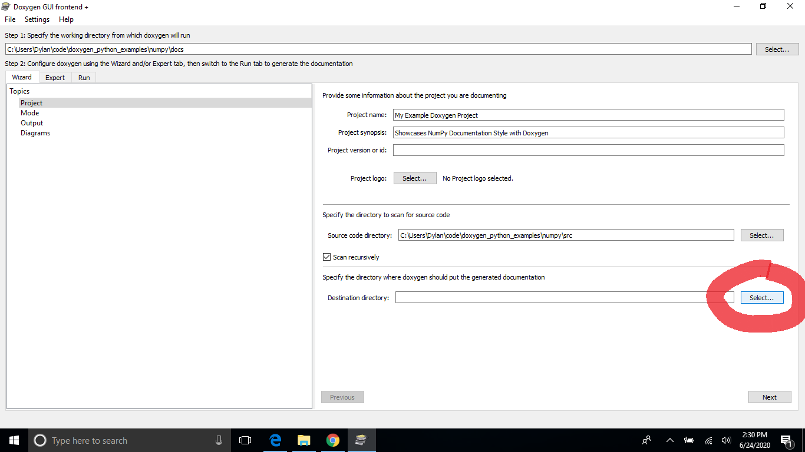
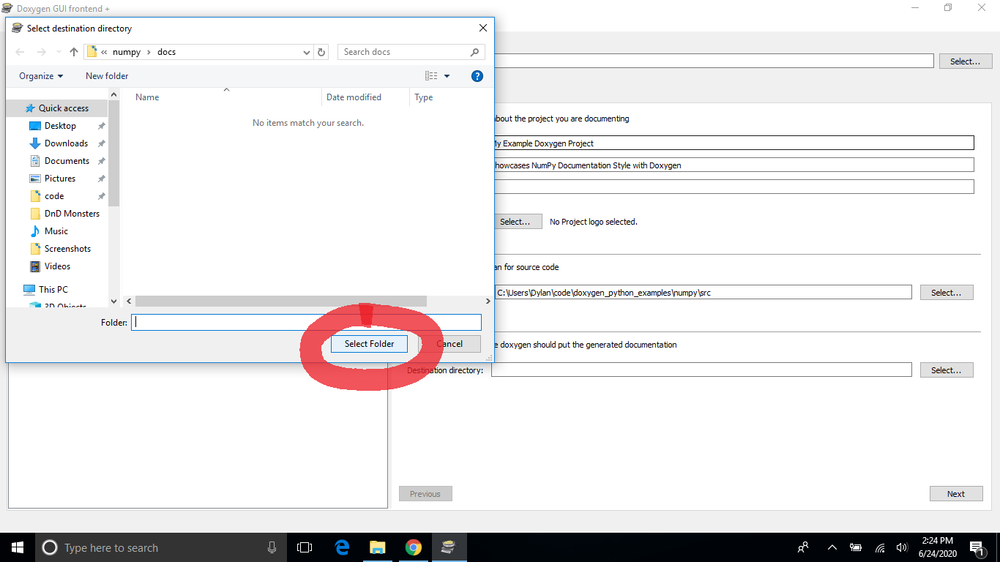
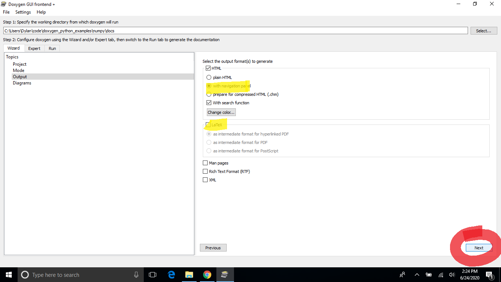
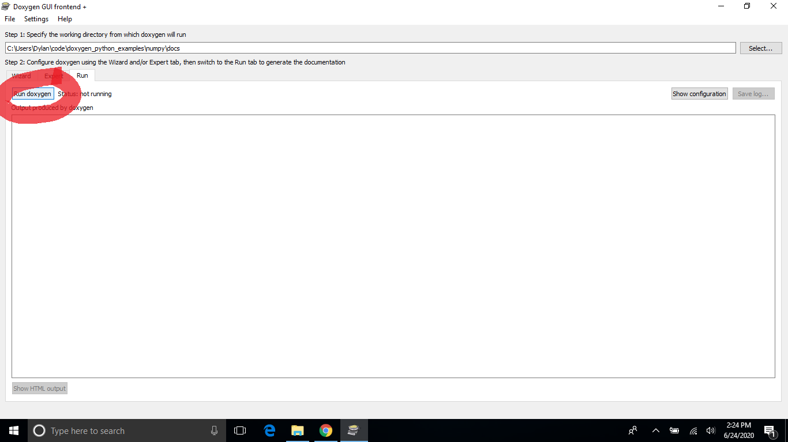
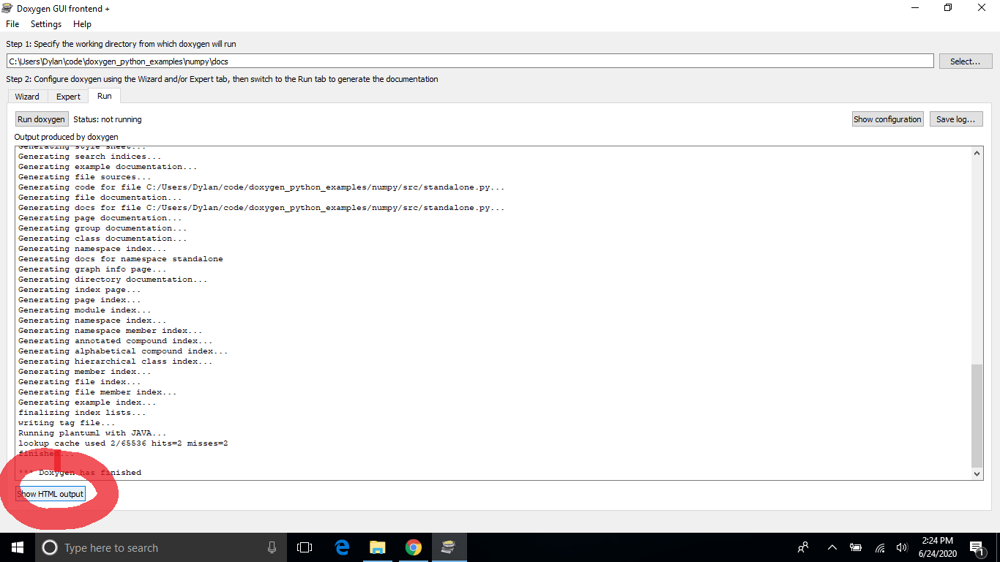

# Generating Doxygen Documentation
{:.no_toc}

This page goes over the steps required to generate Doxygen documentation from code that was written with our [best practices](../best_practices/best_practices.md).

* TOC
{:toc}

1. Open the Doxygen GUI, "doxywizard", by opening the Windows Start Menu, typing "doxywizard" into the prompt, and hitting <kbd>Enter</kbd>.
    
2. Hit the `Select` button for selecting the folder with which Doxygen will run.
    
3. In the dialog box that opens, select where in your repository you would like Doxygen to put the generated documentation and click `Select Folder`.
    
4. Enter the project name and description in the prompts.
    
5. Click the `Select...` button for specifying the directory where the project's source code is.
    
6. Select the source code directory for your project in the dialog box and click the `Select Folder` button.
    
7. In the main GUI menu, select the `Scan recursively` checkbox.
    
8. 

